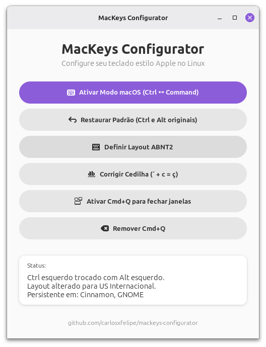

# Mackeys Configurator

Este projeto é um programa para Linux (GNOME e Cinnamon) que permite ajustar o layout de teclados estilo Apple, como o Logitech K380s, K380, K780, Keychron, entre outros. Ele facilita a personalização das teclas para melhor compatibilidade e usabilidade nesses ambientes.

## Funcionalidades

- **Modo macOS** — Troca o Ctrl esquerdo com o Alt esquerdo e aplica o layout US Internacional, replicando o comportamento de digitação dos teclados Apple.
- **Cmd+Q fecha janelas** — Mapeia `Ctrl+Q` (que com o swap ativo equivale ao `Cmd+Q` físico) como atalho para fechar janelas no GNOME e Cinnamon, igual ao macOS.
- **Layout ABNT2** — Aplica o layout de teclado brasileiro padrão.
- **Corrigir Cedilha** — Configura o `~/.XCompose` para que `´ + c` gere `ç` corretamente no layout US Internacional.

## Screenshot



## Como clonar e rodar o projeto

1. **Clone o repositório:**

```bash
git clone https://github.com/carlosxfelipe/mackeys-configurator.git
cd mackeys-configurator
```

2. **Instale as dependências:**

```bash
npm install
```

3. **Inicie o ambiente de desenvolvimento:**

```bash
npm run dev
```

## Como gerar AppImage

Para criar o AppImage do Mackeys Configurator:

1. Certifique-se de que as dependências estejam instaladas:

   ```bash
   npm install
   ```

2. Execute o comando de build para AppImage:

   ```bash
   npm run build:appimage
   ```

O arquivo AppImage será gerado na raiz do projeto com o nome seguindo o padrão `MacKeys-Configurator-[versão]-x86_64.AppImage`.

Se necessário, o script irá baixar o `appimagetool` automaticamente.

### Scripts disponíveis

Além do AppImage, você pode usar outros scripts de build disponíveis em `package.json`:

- `npm run build:sea` — Gera o executável nativo (SEA)
- `npm run build:flatpak` — Gera e instala o Flatpak localmente (requer `flatpak-builder`)

## Licença

Este projeto está licenciado sob a GNU General Public License v3.0 (GPLv3).

Sinta-se à vontade para abrir issues ou contribuir!
